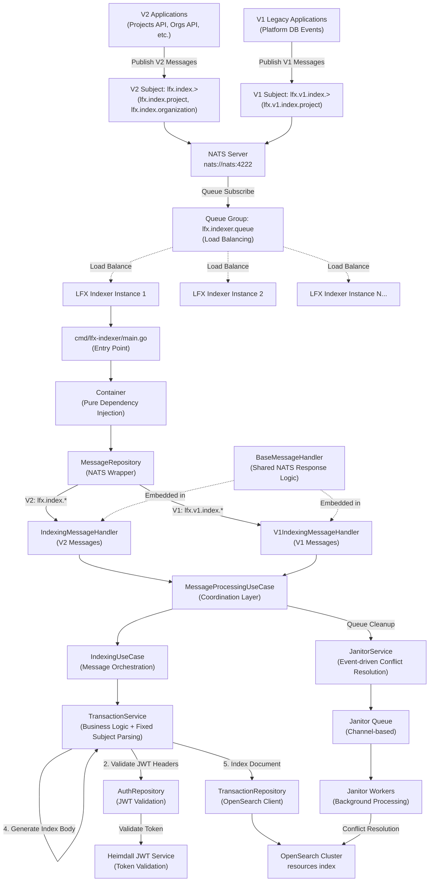
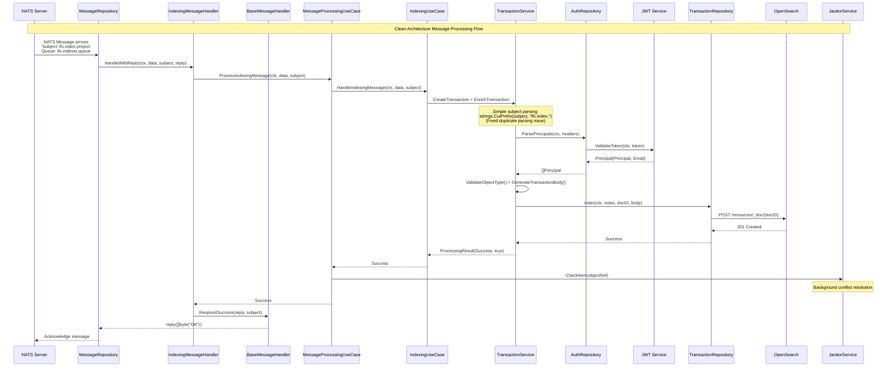

# LFX V2 Indexer Service

A high-performance, Indexer Service for the LFX V2 platform that processes resource transactions into OpenSearch with comprehensive NATS message processing and queue group load balancing.

## 📋 Overview

The LFX V2 Indexer Service is responsible for:
- **Message Processing**: NATS stream processing with queue group load balancing across multiple instances
- **Transaction Enrichment**: JWT authentication, data validation, and principal parsing with delegation support
- **Search Indexing**: High-performance OpenSearch document indexing with optimistic concurrency control  
- **Data Consistency**: Event-driven janitor service for conflict resolution (production-proven pattern)
- **Dual Format Support**: Both LFX v2 (past-tense actions) and legacy v1 (present-tense actions) message formats
- **Health Monitoring**: Kubernetes-ready health check endpoints
- **Clean Architecture**: Maintainable, testable code following clean architecture principles

## 🚀 Quick Start

### Prerequisites
- **Go 1.23+**
- **NATS Server** (message streaming)  
- **OpenSearch/Elasticsearch** (document indexing)
- **Heimdall JWT Service** (authentication)

### Environment Setup
```bash
# Core Services (Required)
export NATS_URL=nats://nats:4222
export OPENSEARCH_URL=http://localhost:9200
export JWKS_URL=http://localhost:4457/.well-known/jwks

# Message Processing
export NATS_QUEUE=lfx.indexer.queue
export OPENSEARCH_INDEX=resources

# Optional Configuration  
export LOG_LEVEL=info
export PORT=8080
```

### Install & Run
```bash
# Install dependencies
go mod download

# Development mode (uses Makefile)
make run

# Build and run using Make
make build-local
./bin/lfx-indexer

# Direct Go commands (new cmd structure)
go run ./cmd/lfx-indexer
go build -o bin/lfx-indexer ./cmd/lfx-indexer

# Command-line options
./bin/lfx-indexer -help
./bin/lfx-indexer -version
./bin/lfx-indexer -check-config
```

### Health Check
```bash
# Kubernetes probes
curl http://localhost:8080/livez    # Liveness probe
curl http://localhost:8080/readyz   # Readiness probe  
curl http://localhost:8080/health   # General health
```

## 🏗️ Architecture & Data Flow


```
┌─────────────────────────────────────────────────────────────────┐
│                    LFX Indexer Service                         │
├─────────────────────────────────────────────────────────────────┤
│  Entry Points (cmd/ - Standard Go Layout)                      │
│  └─ cmd/lfx-indexer/main.go - Pure dependency injection       │
├─────────────────────────────────────────────────────────────────┤
│  Presentation Layer (NATS Protocol + Health Checks)            │
│  ├─ IndexingMessageHandler - V2 message processing            │
│  ├─ V1IndexingMessageHandler - V1 legacy support             │
│  ├─ BaseMessageHandler - Shared NATS response logic          │
│  └─ HealthHandler - Kubernetes health probes                  │
├─────────────────────────────────────────────────────────────────┤
│  Application Layer (Use Case Orchestration)                    │
│  ├─ MessageProcessingUseCase - Complete workflow coordination │
│  └─ IndexingUseCase - Message-to-transaction processing       │
├─────────────────────────────────────────────────────────────────┤
│  Domain Layer (Business Logic)                                 │
│  ├─ TransactionService - Core transaction processing          │
│  ├─ LFXTransaction Entity - Domain model with validation      │
│  ├─ Simple Subject Parsing - Clean constants    │
│  └─ Repository Interfaces - Clean abstractions                │
├─────────────────────────────────────────────────────────────────┤
│  Infrastructure Layer (External Services)                      │
│  ├─ MessageRepository - NATS client with queue groups         │
│  ├─ TransactionRepository - OpenSearch client                 │
│  ├─ AuthRepository - JWT validation (Heimdall integration)    │
│  ├─ JanitorService - Event-driven conflict resolution         │
│  └─ Container - Pure dependency injection                     │
└─────────────────────────────────────────────────────────────────┘
                                 │
                    ┌─────────────▼──────────────┐
                    │   External Dependencies    │
                    │                           │
                    │  NATS ←→ OpenSearch ←→ JWT │
                    │                           │
                    └───────────────────────────┘
```

### Comprehensive Message Processing Flow



## 🔄 Message Processing Flow

### Complete Processing Sequence



### **Layer Responsibilities**

| Layer | Components | Responsibilities |
|-------|------------|-----------------|
| **Entry Point** | cmd/lfx-indexer/main.go | Pure application startup and dependency injection |
| **Presentation** | BaseMessageHandler, IndexingMessageHandler, V1IndexingMessageHandler, HealthHandler | NATS protocol concerns, message parsing, response handling, health checks |
| **Application** | MessageProcessingUseCase, IndexingUseCase | Workflow coordination, use case orchestration |
| **Domain** | TransactionService, LFXTransaction, Simple Subject Parsing | Business logic, domain rules, data validation |
| **Infrastructure** | Container, MessageRepository, TransactionRepository, AuthRepository, JanitorService | External service integration, data persistence, event-driven processing |

## 📊 NATS Configuration & Subjects

### Subject Patterns & Load Balancing

| Subject Pattern | Purpose | Example | Load Balancing |
|----------------|---------|---------|----------------|
| `lfx.index.>` | V2 resource indexing | `lfx.index.project`, `lfx.index.organization` | Queue group distribution |
| `lfx.v1.index.>` | V1 legacy support | `lfx.v1.index.project` | Queue group distribution |

**Queue Group**: `lfx.indexer.queue`
- **Load Balancing**: Automatic distribution across service instances
- **Durability**: Messages processed exactly once per queue group  
- **Fault Tolerance**: Failed instances don't lose messages

### Message Testing

You can test message processing using NATS CLI:

```bash
# Create project message
nats pub lfx.index.project '{
  "action": "created",
  "headers": {"Authorization": "Bearer token"},
  "data": {
    "id": "test-project-123",
    "uid": "test-project-123", 
    "name": "Test Project",
    "slug": "test-project",
    "public": true
  }
}' --server nats://your-nats-server:4222

# Monitor processing
nats sub "lfx.index.>" --server nats://your-nats-server:4222
```

## 🔧 Configuration

### Environment Variables

```bash
# Core Services (Required)
NATS_URL=nats://nats:4222                    # NATS server URL
OPENSEARCH_URL=http://localhost:9200         # OpenSearch endpoint
JWKS_URL=http://localhost:4457/.well-known/jwks  # JWT validation endpoint

# Message Processing
NATS_INDEXING_SUBJECT=lfx.index.>           # V2 subject pattern
NATS_V1_INDEXING_SUBJECT=lfx.v1.index.>    # V1 subject pattern  
NATS_QUEUE=lfx.indexer.queue                # Queue group name
OPENSEARCH_INDEX=resources                   # OpenSearch index name

# NATS Connection Settings
NATS_MAX_RECONNECTS=10                       # Max reconnection attempts
NATS_RECONNECT_WAIT=2s                       # Wait time between reconnects
NATS_CONNECTION_TIMEOUT=10s                  # Initial connection timeout

# JWT Configuration  
JWT_ISSUER=heimdall                          # JWT issuer validation
JWT_AUDIENCES=["audience1","audience2"]      # Allowed audiences (JSON array)
JWT_CLOCK_SKEW=6h                           # Clock skew tolerance

# OpenSearch Settings
OPENSEARCH_TIMEOUT=30s                       # Request timeout

# Server Configuration
PORT=8080                                    # Health check server port
LOG_LEVEL=info                               # Logging level (debug,info,warn,error)
LOG_FORMAT=text                              # Log format (text,json)

# Janitor Service (Background Cleanup)
JANITOR_ENABLED=true                         # Enable janitor service (default: true)

# Janitor Implementation Details:
# - Queue Size: 50 items (hardcoded for stability)
# - Workers: 1 event-driven goroutine 
# - Retry Delay: 5-10 seconds random (hardcoded)
# - Processing: Event-driven via NATS messages (no intervals)
```

### Configuration Validation

The service validates all configuration on startup:

```bash
# Check configuration without starting service
./bin/lfx-indexer -check-config

# Debug configuration issues
LOG_LEVEL=debug ./bin/lfx-indexer -check-config
```

## 🧑‍💻 Development

### Build Targets

```bash
# Local development
make build-local                    # Build for current OS
make run                           # Run with environment setup
make fmt                           # Format code
make lint                          # Run linters
make test                          # Run tests

# Production build
make build                         # Build for Linux (deployment)
make docker-build                  # Build container image
make docker-push                   # Push to registry

# Testing
make test-domain                   # Domain layer tests
make test-application              # Application layer tests  
make test-infrastructure          # Infrastructure layer tests
make test-presentation             # Presentation layer tests
make coverage                      # Generate coverage report

# Code quality
make security                      # Security scanning
make deps-graph                    # Dependency analysis
make complexity                    # Code complexity check
```

### Direct Go Commands

```bash
# Using the new cmd structure
go run ./cmd/lfx-indexer           # Run directly
go build -o bin/lfx-indexer ./cmd/lfx-indexer  # Build directly
go test ./...                      # Run all tests

# Testing specific layers
go test ./internal/domain/...      # Domain tests
go test ./internal/application/... # Application tests
```

## 🚨 Troubleshooting

### Common Issues

**1. NATS Connection Failures**
```bash
# Check NATS connectivity
nats server check --server $NATS_URL

# Verify queue configuration
nats consumer info lfx.indexer.queue --server $NATS_URL

# Test basic pub/sub
nats pub test.subject "hello" --server $NATS_URL
nats sub test.subject --server $NATS_URL
```

**2. OpenSearch Issues**
```bash
# Check OpenSearch health
curl $OPENSEARCH_URL/_cluster/health

# Verify index exists
curl $OPENSEARCH_URL/resources/_mapping

# Check recent documents
curl $OPENSEARCH_URL/resources/_search?size=5&sort=@timestamp:desc
```

**3. JWT Validation Failures**
```bash
# Check Heimdall connectivity
curl $JWKS_URL

# Verify JWT configuration
echo $JWT_AUDIENCES
echo $JWT_CLOCK_SKEW

# Enable debug logging for auth details
LOG_LEVEL=debug ./bin/lfx-indexer
```

**4. Subject Parsing Issues (Fixed)**
Previous versions had duplicate subject parsing causing errors like:
```
failed to parse subject: invalid subject format: project (expected prefix: lfx.index.)
```
This has been **fixed** by removing duplicate parsing in TransactionService.

### Debug Configuration
```bash
# Enable comprehensive debugging
export LOG_LEVEL=debug
export LOG_FORMAT=json

# Reduce janitor buffer for debugging
export JANITOR_QUEUE_SIZE=10
export JANITOR_WORKERS=1

# Enable NATS connection debugging  
export NATS_VERBOSE=true
```

### Performance Monitoring

**Health Endpoints:**
```bash
curl http://localhost:8080/livez    # Kubernetes liveness
curl http://localhost:8080/readyz   # Kubernetes readiness  
curl http://localhost:8080/health   # General health status
```


## 🔒 Security

**JWT Authentication:**
- **Heimdall Integration**: All messages validated against JWT service
- **Multiple Audiences**: Configurable audience validation
- **Principal Parsing**: Authorization header and X-On-Behalf-Of delegation support
- **Machine User Detection**: `clients@` prefix identification

**Input Validation:**
- **Domain Validation**: LFXTransaction entity validates all inputs
- **Subject Format Validation**: Simple string prefix validation
- **Data Structure Validation**: Comprehensive JSON schema validation

**Error Handling:**
- **Safe Error Messages**: No sensitive data leakage
- **Structured Logging**: Detailed error context for debugging
- **Graceful Degradation**: Continue processing on non-critical failures

## 📁 Project Structure

```
├── cmd/                           # Application entry points (Standard Go Layout)
│   ├── lfx-indexer/              # Main indexer service
│   │   └── main.go               # Service entry point
│   └── README.md                 # Command documentation
├── internal/                      # Private application code
│   ├── application/              # Application layer (use cases)
│   │   └── usecases/             # Use case implementations
│   ├── domain/                   # Domain layer (business logic)
│   │   ├── constants/            # Shared constants (subject prefixes)
│   │   ├── entities/             # Domain entities
│   │   ├── repositories/         # Repository interfaces
│   │   └── services/             # Domain services
│   ├── infrastructure/           # Infrastructure layer
│   │   ├── config/               # Configuration management
│   │   ├── opensearch/           # OpenSearch client
│   │   ├── nats/                 # NATS messaging
│   │   └── jwt/                  # JWT authentication
│   ├── presentation/             # Presentation layer
│   │   └── handlers/             # HTTP and message handlers
│   ├── container/                # Dependency injection
│   └── mocks/                    # Mock implementations
├── bin/                          # Compiled binaries
├── deployments/                  # Deployment configurations
├── docs/                         # Documentation
├── Dockerfile                    # Container definition
├── Makefile                      # Build automation
├── go.mod                        # Go dependencies
└── README.md                     # This file
```


## 📄 License

This project is licensed under the MIT License - see the LICENSE file for details.