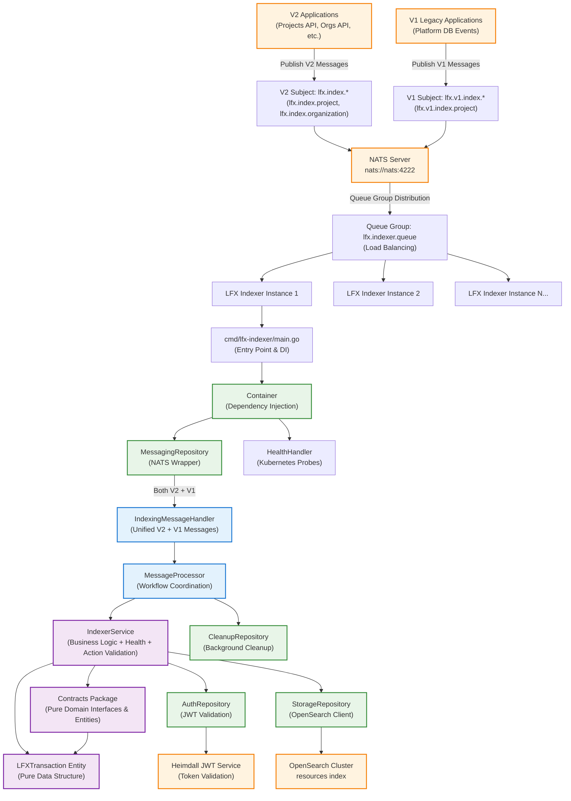
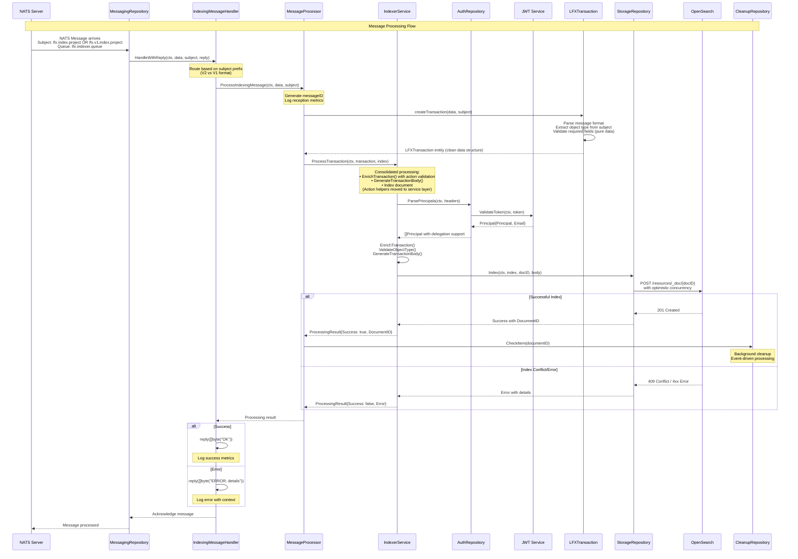

# LFX V2 Indexer Service

A high-performance, indexer service for the LFX V2 platform that processes resource transactions into OpenSearch with comprehensive NATS message processing and queue group load balancing.

## 📋 Overview

The LFX V2 Indexer Service is responsible for:

- **Message Processing**: NATS stream processing with queue group load balancing across multiple instances
- **Transaction Enrichment**: JWT authentication, data validation, and principal parsing with delegation support
- **Search Indexing**: OpenSearch document indexing with optimistic concurrency control  
- **Data Consistency**: Event-driven janitor service for conflict resolution
- **Dual Format Support**: Both LFX v2 (past-tense actions) and legacy v1 (present-tense actions) message formats
- **Health Monitoring**: Kubernetes-ready health check endpoints

## 🚀 Quick Start

### Prerequisites

- **Go 1.24**
- **NATS Server** (message streaming)
- **OpenSearch/Elasticsearch** (document indexing)
- **Heimdall JWT Service** (authentication)

### Environment Setup

```bash
# Core Services (Required)
export NATS_URL=nats://nats:4222
export OPENSEARCH_URL=http://localhost:9200
export JWKS_URL=http://localhost:4457/.well-known/jwks

# Message Processing
export NATS_QUEUE=lfx.indexer.queue
export OPENSEARCH_INDEX=resources

# Optional Configuration
export LOG_LEVEL=info
export PORT=8080
```

### Install & Run

```bash
# Install dependencies
go mod download

# Development mode
make run

# Build and run
make build-local
./bin/lfx-indexer

# Direct Go commands
go run ./cmd/lfx-indexer
go build -o bin/lfx-indexer ./cmd/lfx-indexer

# Command-line options
./bin/lfx-indexer -help
./bin/lfx-indexer -check-config
```

### CLI Flags

```bash
# Service configuration
./bin/lfx-indexer -p 9090              # Custom health check port
./bin/lfx-indexer --bind 0.0.0.0       # Bind to all interfaces
./bin/lfx-indexer -d                   # Enable debug logging

# Feature toggles
./bin/lfx-indexer --nojanitor          # Disable janitor service (overrides JANITOR_ENABLED)
./bin/lfx-indexer --simple-health      # Use simple 'OK' health responses

# Utilities
./bin/lfx-indexer --help              # Show help message
```

**Note**: CLI flags have highest precedence: `CLI flags > Environment variables > Defaults`

### Health Check

```bash
# Kubernetes probes
curl http://localhost:8080/livez    # Liveness probe
curl http://localhost:8080/readyz   # Readiness probe
curl http://localhost:8080/health   # General health
```

## 🏗️ Architecture Overview

```
┌─────────────────────────────────────────────────────────────────┐
│                    LFX Indexer Service                         │
├─────────────────────────────────────────────────────────────────┤
│  Entry Points (cmd/ - Standard Go Layout)                      │
│  └─ cmd/lfx-indexer/main.go - Pure dependency injection       │
├─────────────────────────────────────────────────────────────────┤
│  Presentation Layer (NATS Protocol + Health Checks)            │
│  ├─ IndexingMessageHandler - Unified V2/V1 message processing │
│  ├─ BaseMessageHandler - Shared NATS response logic          │
│  └─ HealthHandler - Kubernetes health probes                  │
├─────────────────────────────────────────────────────────────────┤
│  Application Layer (Orchestration)                             │
│  └─ MessageProcessor - Complete workflow coordination          │
├─────────────────────────────────────────────────────────────────┤
│  Domain Layer (Business Logic)                                 │
│  ├─ IndexerService - Consolidated transaction + health logic  │
│  ├─ Contracts Package - Pure domain interfaces & entities    │
│  └─ Repository Interfaces - Clean abstractions                │
├─────────────────────────────────────────────────────────────────┤
│  Infrastructure Layer (External Services)                      │
│  ├─ MessagingRepository - NATS client with queue groups       │
│  ├─ StorageRepository - OpenSearch client                     │
│  ├─ AuthRepository - JWT validation (Heimdall integration)    │
│  ├─ CleanupRepository - Background cleanup operations         │
│  └─ Container - Pure dependency injection                     │
└─────────────────────────────────────────────────────────────────┘
                                 │
                    ┌─────────────▼──────────────┐
                    │   External Dependencies    │
                    │                           │
                    │  NATS ←→ OpenSearch ←→ JWT │
                    │                           │
                    └───────────────────────────┘
```

## 📊 Data Flow Architecture



## 🔄 Message Processing Sequence



## 🔧 Configuration & Environment

### Core Environment Variables

```bash
# Required Services
NATS_URL=nats://nats:4222                    # NATS server URL
OPENSEARCH_URL=http://localhost:9200         # OpenSearch endpoint
JWKS_URL=http://localhost:4457/.well-known/jwks  # JWT validation endpoint

# Message Processing
NATS_INDEXING_SUBJECT=lfx.index.>           # V2 subject pattern
NATS_V1_INDEXING_SUBJECT=lfx.v1.index.>    # V1 subject pattern
NATS_QUEUE=lfx.indexer.queue                # Queue group name
OPENSEARCH_INDEX=resources                   # OpenSearch index name

# NATS Connection Settings
NATS_MAX_RECONNECTS=10                       # Max reconnection attempts
NATS_RECONNECT_WAIT=2s                       # Wait time between reconnects
NATS_CONNECTION_TIMEOUT=10s                  # Initial connection timeout

# JWT Configuration
JWT_ISSUER=heimdall                          # JWT issuer validation
JWT_AUDIENCES=["audience1","audience2"]      # Allowed audiences (JSON array)
JWT_CLOCK_SKEW=6h                           # Clock skew tolerance

# Server Configuration
PORT=8080                                    # Health check server port
LOG_LEVEL=info                               # Logging level (debug,info,warn,error)
LOG_FORMAT=text                              # Log format (text,json)

# Cleanup Service (Background Cleanup)
JANITOR_ENABLED=true                         # Enable cleanup service (default: true)
```

### NATS Subject Patterns & Load Balancing

| Subject Pattern | Purpose | Example | Load Balancing |
|----------------|---------|---------|----------------|
| `lfx.index.*` | V2 resource indexing | `lfx.index.project`, `lfx.index.organization` | Queue group distribution |
| `lfx.v1.index.*` | V1 legacy support | `lfx.v1.index.project` | Queue group distribution |

**Queue Group**: `lfx.indexer.queue`

- **Load Balancing**: Automatic distribution across service instances
- **Durability**: Messages processed exactly once per queue group
- **Fault Tolerance**: Failed instances don't lose messages

## 📁 Project Structure

```
├── cmd/                           # Application entry points (Standard Go Layout)
│   └── lfx-indexer/              # Main indexer service
│       ├── main.go               # Service entry point & dependency injection
│       ├── cli.go                # CLI command handling
│       └── server.go             # HTTP server setup
├── internal/                      # Private application code
│   ├── application/              # Application layer (use cases)
│   │   ├── message_processor.go  # Message processing coordination
│   │   └── message_processor_test.go # Application layer tests
│   ├── domain/                   # Domain layer (business logic)
│   │   ├── contracts/            # Domain contracts/interfaces & entities
│   │   │   ├── auth.go           # Auth repository interface
│   │   │   ├── cleanup.go        # Cleanup repository interface
│   │   │   ├── messaging.go      # Messaging repository interface
│   │   │   ├── storage.go        # Storage repository interface
│   │   │   └── transaction.go    # Transaction interfaces & entity types (pure data)
│   │   └── services/             # Domain services
│   │       ├── indexer_service.go # Core indexer business logic + action validation
│   │       └── indexer_service_test.go # Domain service tests
│   ├── infrastructure/           # Infrastructure layer
│   │   ├── auth/                 # Authentication
│   │   │   ├── auth_repository.go # JWT validation implementation
│   │   │   └── auth_repository_test.go # Auth tests
│   │   ├── config/               # Configuration management
│   │   │   ├── app_config.go     # Application configuration
│   │   │   └── cli_config.go     # CLI configuration
│   │   ├── cleanup/               # Background cleanup operations
│   │   │   ├── cleanup_repository.go # Background cleanup repository
│   │   │   └── cleanup_repository_test.go # Cleanup tests
│   │   ├── messaging/            # NATS messaging
│   │   │   ├── messaging_repository.go # NATS client wrapper
│   │   │   └── messaging_repository_test.go # Messaging tests
│   │   └── storage/              # OpenSearch storage
│   │       ├── storage_repository.go # OpenSearch client wrapper
│   │       └── storage_repository_test.go # Storage tests
│   ├── presentation/             # Presentation layer
│   │   └── handlers/             # Message and HTTP handlers
│   │       ├── health_handler.go # Kubernetes health check endpoints
│   │       ├── health_handler_test.go # Health handler tests
│   │       ├── indexing_message_handler.go # NATS message handler
│   │       └── indexing_message_handler_test.go # Handler tests
│   ├── enrichers/                # Data enrichment utilities
│   │   ├── default_enricher.go   # Default enrichment with configurable options
│   │   ├── project_enricher.go   # Project-specific enrichment
│   │   ├── project_settings_enricher.go # Project settings enrichment
│   │   ├── committee_enricher.go # Committee-specific enrichment
│   │   ├── committee_settings_enricher.go # Committee settings enrichment
│   │   └── registry.go           # Enricher registry
│   ├── container/                # Dependency injection
│   │   ├── container.go          # DI container implementation
│   │   └── container_test.go     # Container tests
│   └── mocks/                    # Mock implementations
│       └── repositories.go       # Repository mocks for testing
├── pkg/                          # Public packages (reusable)
│   ├── constants/                # Shared constants
│   │   ├── app.go                # Application constants
│   │   ├── auth.go               # Authentication constants
│   │   ├── errors.go             # Error constants
│   │   ├── health.go             # Health check constants
│   │   └── messaging.go          # Messaging constants
│   └── logging/                  # Logging utilities
│       ├── logger.go             # Logger implementation
│       ├── logger_test.go        # Logger tests
│       └── testing.go            # Test logging utilities
├── deployment/                   # Deployment configurations
│   └── deployment.yaml          # Kubernetes deployment
├── Dockerfile                    # Container definition
├── Makefile                      # Build automation
├── go.mod                        # Go module definition
├── go.sum                        # Go module checksums
├── run.sh                        # Development run script
└── README.md                     # This file
```

### Layer Responsibilities

| Layer | Components | Responsibilities |
|-------|------------|-----------------|
| **Entry Point** | `cmd/lfx-indexer/main.go` | Pure application startup and dependency injection |
| **Presentation** | `IndexingMessageHandler`, `HealthHandler` | NATS protocol concerns, message parsing, response handling, health checks |
| **Application** | `MessageProcessor` | Workflow coordination, use case orchestration |
| **Domain** | `IndexerService`, `Contracts Package`, `LFXTransaction Entity` | Business logic, action validation, pure domain data structures, repository interfaces |
| **Infrastructure** | `Container`, `MessagingRepository`, `StorageRepository`, `AuthRepository`, `CleanupRepository` | External service integration, data persistence, event-driven processing |

## 📚 Client Integration

### Indexing Your Resources

The LFX V2 Indexer Service provides two approaches for indexing your resources:

1. **Server-Side Enrichment** - Send your resource data and let the server handle indexing metadata (⚠️ **will be removed in future releases**)
2. **Client-Provided Configuration** - Provide complete indexing metadata via `indexing_config` for full control (**✅ recommended**)

**⚠️ Important: Use client-provided configuration (option 2).** Server-side enrichers will be removed once all clients migrate to providing their own `indexing_config`.

For detailed guidance on integrating with the indexer service, see the **[Client Guide](docs/client-guide.md)**:

- **Message Format**: Learn the `IndexerMessageEnvelope` structure
- **Field Reference**: Complete reference of all available fields
- **Examples**: Real-world examples for create, update, and delete operations
- **Best Practices**: Tips for optimal search performance and access control
- **Go Client Integration**: Using the public `pkg/types` package

Quick example with client-provided configuration:

```json
{
  "action": "created",
  "headers": {
    "authorization": "Bearer <token>"
  },
  "data": {
    "id": "proj-123",
    "name": "My Project"
  },
  "indexing_config": {
    "object_id": "proj-123",
    "public": true,
    "access_check_object": "project:proj-123",
    "access_check_relation": "viewer",
    "history_check_object": "project:proj-123",
    "history_check_relation": "historian",
    "sort_name": "my project",
    "name_and_aliases": ["My Project"],
    "tags": ["featured"]
  }
}
```

**Key Benefits of `indexing_config`:**
- ✅ No server-side enricher required for your object type
- ✅ Full control over indexing behavior and access control
- ✅ Better performance (bypasses server-side computation)
- ✅ Server automatically sets timestamps and principal fields

See the **[Client Guide](docs/client-guide.md)** for complete documentation.

## Data Enrichment System

The LFX V2 Indexer Service includes a powerful data enrichment system that transforms raw transaction data into search-optimized documents with access control, metadata, and full-text search capabilities.

### Enricher Architecture

The enricher system uses a **configurable option pattern** that allows for flexible customization while maintaining code reuse:

```go
// Base enricher with configurable behavior
enricher := newDefaultEnricher(
    constants.ObjectTypeCommittee,
    WithAccessControl(customAccessControlFunction),
    WithNameAndAliases(customNameExtractionFunction),
    WithPublicFlag(customPublicFlagFunction),
    WithParentReferences(customParentReferenceFunction),
)
```

#### Default Behavior

```go
// Input data
{
    "uid": "committee-123",
    "name": "Technical Steering Committee"
}

// Enriched output
{
    "object_id": "committee-123",
    "object_type": "committee",
    "public": false,
    "access_check_object": "committee:committee-123",
    "access_check_relation": "auditor",        // Committee-settings default
    "history_check_object": "committee:committee-123",
    "history_check_relation": "writer",
    "sort_name": "Technical Steering Committee",
    "name_and_aliases": ["Technical Steering Committee"],
    "fulltext": "Technical Steering Committee"
}
```

### Creating Custom Enrichers

To create a custom enricher, you define methods on your enricher struct and use the option pattern to override specific behaviors:

```go
type CustomEnricher struct {
    defaultEnricher Enricher
}

// Implement the Enricher interface
func (e *CustomEnricher) ObjectType() string {
    return e.defaultEnricher.ObjectType()
}

func (e *CustomEnricher) EnrichData(body *contracts.TransactionBody, transaction *contracts.LFXTransaction) error {
    return e.defaultEnricher.EnrichData(body, transaction)
}

// Custom access control method
func (e *CustomEnricher) setAccessControl(body *contracts.TransactionBody, data map[string]any, objectType, objectID string) {
    // Custom logic - override specific defaults
    if accessCheckRelation, ok := data["accessCheckRelation"].(string); ok {
        body.AccessCheckRelation = accessCheckRelation
    } else if _, exists := data["accessCheckRelation"]; !exists {
        body.AccessCheckRelation = "custom-role" // Your custom default
    }
    
    // Keep standard logic for other fields or customize as needed
    if _, exists := data["accessCheckObject"]; !exists {
        body.AccessCheckObject = fmt.Sprintf("%s:%s", objectType, objectID)
    }
    // ... handle other access control fields
}

// Constructor using method reference and option pattern
func NewCustomEnricher() Enricher {
    enricher := &CustomEnricher{}
    enricher.defaultEnricher = newDefaultEnricher(
        constants.ObjectTypeCustom,
        WithAccessControl(enricher.setAccessControl), // Method reference
    )
    return enricher
}
```

### Available Override Options

| Option | Function Signature | Purpose |
|--------|-------------------|---------|
| `WithAccessControl` | `func(body, data, objectType, objectID)` | Override access control logic |
| `WithNameAndAliases` | `func(data) []string` | Override name/alias extraction |
| `WithPublicFlag` | `func(data) bool` | Override public flag logic |
| `WithParentReferences` | `func(body, data, objectType)` | Override parent reference logic |

### Extending the Enricher System

To add a new enricher:

1. **Create the enricher struct**:
```go
type MyCustomEnricher struct {
    defaultEnricher Enricher
}
```

2. **Implement the Enricher interface**:
```go
func (e *MyCustomEnricher) ObjectType() string {
    return e.defaultEnricher.ObjectType()
}

func (e *MyCustomEnricher) EnrichData(body *contracts.TransactionBody, transaction *contracts.LFXTransaction) error {
    return e.defaultEnricher.EnrichData(body, transaction)
}
```

3. **Add custom behavior** (optional):
```go
func (e *MyCustomEnricher) customMethod(body *contracts.TransactionBody, data map[string]any, objectType, objectID string) {
    // Your custom logic
}
```

4. **Create constructor with options**:
```go
func NewMyCustomEnricher() Enricher {
    enricher := &MyCustomEnricher{}
    enricher.defaultEnricher = newDefaultEnricher(
        constants.ObjectTypeCustom,
        WithAccessControl(enricher.customMethod),
    )
    return enricher
}
```

5. **Register in the enricher registry**:
```go
// In registry.go
registry.Register(NewMyCustomEnricher())
```

This pattern allows you to:
- **Reuse** default enrichment logic
- **Override** specific behaviors as needed
- **Extend** with custom methods and logic
- **Maintain** consistency across enrichers
- **Test** individual components easily

## 🧑‍💻 Development

### Build Targets

```bash
# Local development
make build-local                    # Build for current OS
make run                           # Run with environment setup
make fmt                           # Format code
make lint                          # Run linters
make test                          # Run tests

# Production build
make build                         # Build for Linux (deployment)
make docker-build                  # Build container image
make docker-push                   # Push to registry

# Testing by layer
make test-domain                   # Domain layer tests
make test-application              # Application layer tests
make test-infrastructure          # Infrastructure layer tests
make test-presentation             # Presentation layer tests
make coverage                      # Generate coverage report
```

### Testing Message Processing

```bash
# Test V2 message format
nats pub lfx.index.project '{
  "action": "created",
  "headers": {"Authorization": "Bearer token"},
  "data": {
    "id": "test-project-123",
    "uid": "test-project-123",
    "name": "Test Project",
    "slug": "test-project",
    "public": true
  }
}' --server nats://your-nats-server:4222

# Test V1 message format
nats pub lfx.v1.index.project '{
  "action": "create",
  "data": {
    "id": "test-project-456",
    "name": "Legacy Project"
  },
  "v1_data": {
    "legacy_field": "legacy_value"
  }
}' --server nats://your-nats-server:4222

# Monitor processing
nats sub "lfx.index.>" --server nats://your-nats-server:4222
```

## 🚨 Troubleshooting

### Common Issues

**1. NATS Connection Failures**

```bash
# Check NATS connectivity
nats server check --server $NATS_URL

# Verify queue configuration
nats consumer info lfx.indexer.queue --server $NATS_URL

# Test basic pub/sub
nats pub test.subject "hello" --server $NATS_URL
nats sub test.subject --server $NATS_URL
```

**2. OpenSearch Issues**

```bash
# Check OpenSearch health
curl $OPENSEARCH_URL/_cluster/health

# Verify index exists
curl $OPENSEARCH_URL/resources/_mapping

# Check recent documents
curl $OPENSEARCH_URL/resources/_search?size=5&sort=@timestamp:desc
```

**3. JWT Validation Failures**

```bash
# Check Heimdall connectivity
curl $JWKS_URL

# Enable debug logging for auth details
LOG_LEVEL=debug ./bin/lfx-indexer
```

### Performance Monitoring

**Health Endpoints:**

```bash
curl http://localhost:8080/livez    # Kubernetes liveness
curl http://localhost:8080/readyz   # Kubernetes readiness
curl http://localhost:8080/health   # General health status
```

**Debug Configuration:**

```bash
# Enable comprehensive debugging
export LOG_LEVEL=debug
export LOG_FORMAT=json

# Monitor message processing
LOG_LEVEL=debug make run
```

## 🔒 Security

**JWT Authentication:**

- **Heimdall Integration**: All messages validated against JWT service
- **Multiple Audiences**: Configurable audience validation
- **Principal Parsing**: Authorization header and X-On-Behalf-Of delegation support
- **Machine User Detection**: `@clients` suffix identification

**Input Validation:**

- **Domain Validation**: LFXTransaction entity validates all inputs
- **Subject Format Validation**: String prefix validation with enhanced error messages
- **Data Structure Validation**: Comprehensive JSON schema validation

**Error Handling:**

- **Safe Error Messages**: No sensitive data leakage
- **Structured Logging**: Detailed error context for debugging
- **Graceful Degradation**: Continue processing on non-critical failures

## 🐳 Deployment

### Helm Chart

```bash

# Install with Make
make helm-install

# Uninstall with Make
make helm-uninstall

# Manual installation with custom namespace/values
helm install lfx-indexer ./charts/lfx-v2-indexer-service \
  --namespace lfx \
  --create-namespace \
  --values custom-values.yaml


# Manual upgrade
helm upgrade lfx-indexer ./charts/lfx-v2-indexer-service \
  --namespace lfx
```

### Docker

```bash
# Build container
make docker-build

# Run container
docker run -p 8080:8080 \
  -e NATS_URL=nats://nats:4222 \
  -e OPENSEARCH_URL=http://opensearch:9200 \
  -e JWKS_URL=http://heimdall:4457/.well-known/jwks \
  lfx-v2-indexer-service:latest
```

## 📄 License

This project uses dual licensing to cover different types of content:

### Software License (MIT)

The source code in this project is licensed under the **MIT License**. See the [LICENSE](LICENSE) file for the complete license text.

**Copyright**: The Linux Foundation and each contributor to LFX.

### Documentation License (Creative Commons)

The documentation in this project is licensed under the **Creative Commons Attribution 4.0 International License**. See the [LICENSE-docs](LICENSE-docs) file for the complete license text.

### Security Policy

For information about reporting security vulnerabilities, please see our [SECURITY.md](SECURITY.md) file.

### Code Ownership

Code review and maintenance responsibilities are defined in the [CODEOWNERS](CODEOWNERS) file.

---
